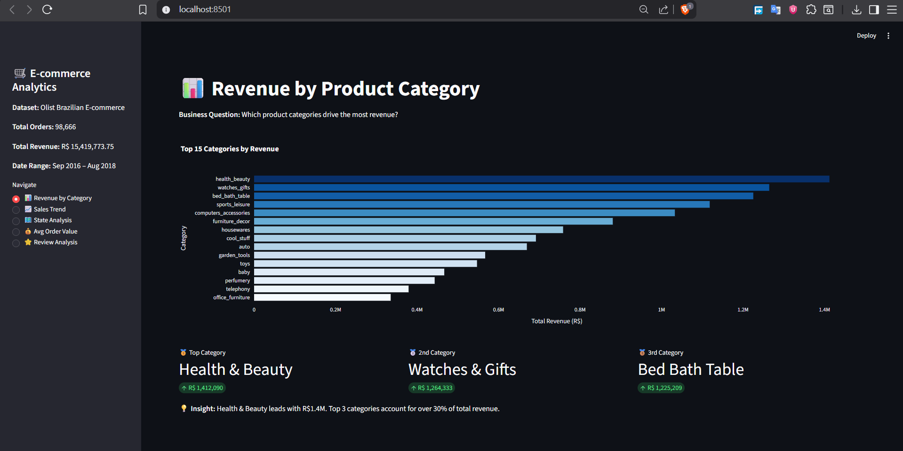
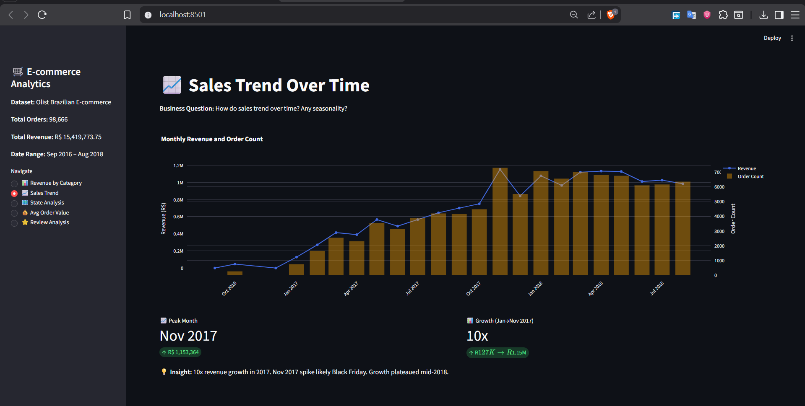
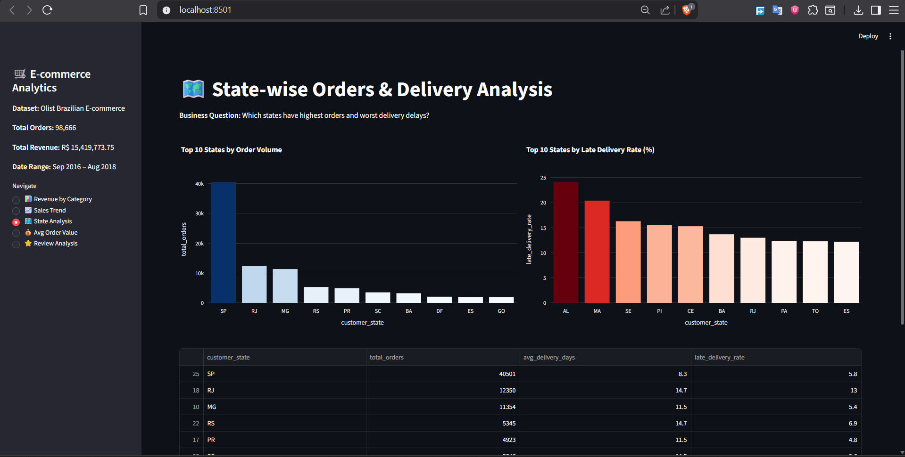
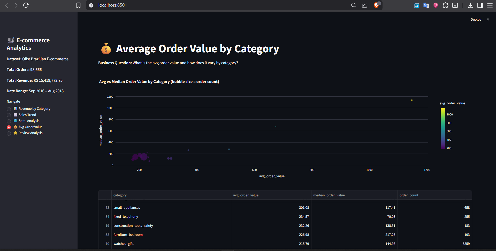
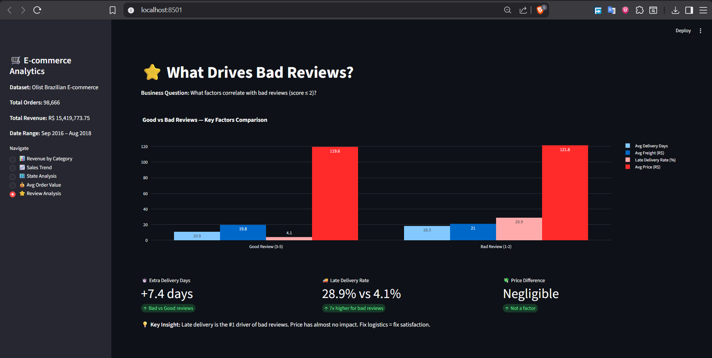

Create `README.md` in root:

```markdown
# 🛒 Brazilian E-commerce Sales Intelligence Dashboard

> End-to-end sales analytics on 100,000+ real orders using Python, SQL, and Streamlit.


---

## 📌 Project Overview

Analyzed the **Olist Brazilian E-commerce dataset** (100K+ orders, 9 tables, 2016–2018) to answer 5 real business questions a Data Analyst would face on Day 1.

**Dataset:** [Olist Brazilian E-commerce – Kaggle](https://www.kaggle.com/datasets/olistbr/brazilian-ecommerce)

---

## 🎯 Business Questions Answered

| # | Question | Method |
|---|---|---|
| 1 | Which product categories drive most revenue? | Aggregation + Ranking |
| 2 | How do sales trend over time? Any seasonality? | Time Series Analysis |
| 3 | Which states have highest orders + delivery delays? | Geo Analysis |
| 4 | What is avg order value by category? | Distribution Analysis |
| 5 | What factors correlate with bad reviews? | Correlation Analysis |

---

## 💡 Key Insights

- **Health & Beauty** tops revenue at R$1.4M — top 3 categories = 30%+ of total revenue
- **10x revenue growth** from Jan → Nov 2017. Nov 2017 spike = Black Friday effect
- **SP state** dominates with 40K orders and fastest delivery (8.3 days avg)
- **Northern states** (AL, MA, CE) suffer 20–24% late delivery rates
- **Late delivery is #1 driver of bad reviews** — 28.9% late rate for bad reviews vs 4.1% for good. Price has negligible impact.

---

## 🛠️ Tech Stack

| Layer | Tool |
|---|---|
| Data Processing | Python, Pandas, NumPy |
| Storage | SQLite |
| Visualization | Plotly |
| Dashboard | Streamlit |
| Version Control | Git + GitHub |

---

## 📊 Dashboard Screenshots

### Revenue by Category


### Sales Trend Over Time


### State-wise Analysis


### Average Order Value by Category


### Review Analysis


---

## 🗂️ Project Structure

```
ecommerce-sales-analytics/
├── assets/                  ← Dashboard screenshots
├── data/
│   ├── raw/                 ← Olist CSVs (not tracked)
│   └── processed/           ← Master dataset (not tracked)
├── src/
│   ├── load_data.py         ← Load all 9 CSVs
│   ├── clean.py             ← Merge + clean → master dataset
│   └── analysis.py          ← 5 business question functions
├── app.py                   ← Streamlit dashboard
├── requirements.txt
└── README.md
```

---

## 🚀 Run Locally

```bash
# Clone repo
git clone https://github.com/RenoX23/ecommerce-sales-analytics.git
cd ecommerce-sales-analytics

# Setup environment
python -m venv venv
source venv/Scripts/activate  # Windows Git Bash
pip install -r requirements.txt

# Download dataset
# https://www.kaggle.com/datasets/olistbr/brazilian-ecommerce
# Extract CSVs to data/raw/

# Build master dataset
python src/clean.py

# Run dashboard
streamlit run app.py
```

---

## 📬 Connect

**Renold Stephen** — M.Tech CS, Christ University Bangalore
[GitHub](https://github.com/RenoX23) • [LinkedIn](https://linkedin.com/in/YOUR_LINKEDIN)
```


